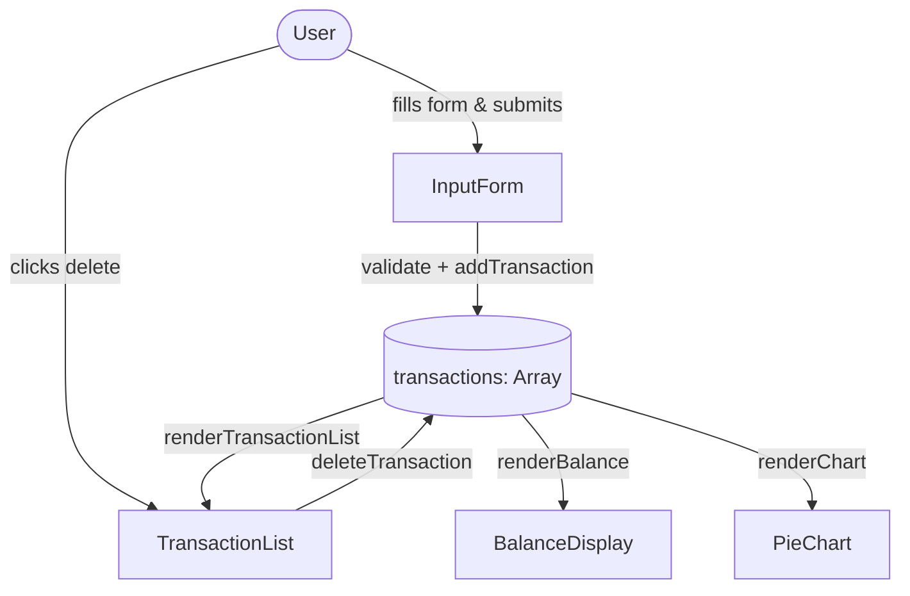

# Design Document: Expense Tracker

## Overview

The expense tracker is a single-page web application built with vanilla HTML, CSS, and JavaScript — no build tools, no frameworks, no bundler. All logic runs in the browser; there is no backend or persistent storage beyond the current session.

The app lets users record expense transactions (name, amount, category), view them in a scrollable list, delete individual entries, and see their total balance and a category breakdown pie chart — all updating reactively on every add or delete.

**Key design decisions:**

- **No framework**: Keeps the bundle tiny (well under 500 KB) and removes build complexity. DOM manipulation is straightforward given the limited scope.
- **Chart.js via CDN**: Satisfies the charting requirement without adding a local asset. Chart.js is excluded from the 500 KB budget per the requirements.
- **In-memory state**: A single JavaScript array is the source of truth. All UI components re-render from this array on every mutation.
- **Single file or minimal files**: `index.html`, `style.css`, `app.js` — three files, no module bundler needed.

---

## Architecture

The app follows a simple **unidirectional data flow**:

```
User Action → State Mutation → Re-render All Components
```



There is no event bus or reactive framework. After every state mutation, three render functions are called explicitly:

1. `renderTransactionList()`
2. `renderBalance()`
3. `renderChart()`

This is intentionally simple and sufficient for the scale of this app.

---

## Components and Interfaces

### InputForm

Responsible for collecting user input and triggering validation before handing off to the state layer.

**DOM elements:**
- `#name-input` — text field for item name
- `#amount-input` — number field for amount
- `#category-select` — `<select>` with options: Food, Transport, Fun
- `#add-btn` — submit button
- `#error-msg` — inline error display area

**Interface:**

```js
// Called on form submit
function handleFormSubmit(event) { ... }

// Returns null if valid, or an error string if invalid
function validateForm(name, amount, category) { ... }

// Resets all fields to default empty state
function resetForm() { ... }
```

**Validation rules:**
- `name`: must be a non-empty string after trimming whitespace
- `amount`: must be a finite positive number (> 0)
- `category`: must be one of `"Food"`, `"Transport"`, `"Fun"`

### TransactionList

Renders the list of transactions and wires up delete controls.

**DOM element:** `#transaction-list` (a `<ul>` or `<div>` with `overflow-y: auto`)

**Interface:**

```js
// Rebuilds the list DOM from the current transactions array
function renderTransactionList() { ... }

// Called when a delete button is clicked; removes by id
function deleteTransaction(id) { ... }
```

Each list item is rendered with a unique `data-id` attribute so the delete handler can identify which transaction to remove.

### BalanceDisplay

Shows the running total of all transaction amounts.

**DOM element:** `#balance-display`

**Interface:**

```js
// Recomputes sum and updates the DOM
function renderBalance() { ... }
```

### PieChart

Renders a Chart.js pie chart showing spending proportion per category.

**DOM element:** `<canvas id="spending-chart">`

**Interface:**

```js
// Creates or updates the Chart.js instance
function renderChart() { ... }
```

The Chart.js instance is held in a module-level variable. On each render, `chart.data` is updated and `chart.update()` is called rather than destroying and recreating the instance (avoids flicker).

When there are no transactions, the chart is destroyed (or hidden) and a placeholder message is shown.

### State Module

The single source of truth.

```js
// In-memory array of transaction objects
let transactions = [];

// Adds a transaction and triggers re-render
function addTransaction(name, amount, category) { ... }

// Removes a transaction by id and triggers re-render
function deleteTransaction(id) { ... }

// Returns a copy of the current transactions array
function getTransactions() { ... }

// Computes total balance
function computeBalance() { ... }

// Computes per-category totals for the chart
function computeCategoryTotals() { ... }
```

---

## Data Models

### Transaction

```js
{
  id: string,        // crypto.randomUUID() or Date.now().toString()
  name: string,      // trimmed, non-empty
  amount: number,    // positive float
  category: string   // "Food" | "Transport" | "Fun"
}
```

### AppState

```js
{
  transactions: Transaction[]  // ordered by insertion time (append-only, delete by id)
}
```

### CategoryTotals (derived, not stored)

```js
{
  Food: number,
  Transport: number,
  Fun: number
}
```

Computed on demand from `transactions` by `computeCategoryTotals()`. Not persisted.

### ValidationResult

```js
{
  valid: boolean,
  error: string | null   // human-readable message, null when valid
}
```

---

## Correctness Properties

*A property is a characteristic or behavior that should hold true across all valid executions of a system — essentially, a formal statement about what the system should do. Properties serve as the bridge between human-readable specifications and machine-verifiable correctness guarantees.*

### Property 1: Balance equals sum of transaction amounts

*For any* list of transactions (including the empty list), `computeBalance()` SHALL equal the arithmetic sum of all `amount` fields in the array. When the array is empty the result SHALL be 0.

**Validates: Requirements 4.2, 4.3, 4.4, 4.5**

---

### Property 2: Adding a valid transaction grows the list by one

*For any* transactions array and any valid transaction input (non-empty name, positive amount, valid category), calling `addTransaction` SHALL increase the length of the transactions array by exactly one and the new entry SHALL be retrievable by its id.

**Validates: Requirements 1.5**

---

### Property 3: Deleting a transaction removes it from the list

*For any* transactions array containing at least one transaction, calling `deleteTransaction(id)` SHALL produce a transactions array that contains no entry with that id, and the array length SHALL decrease by exactly one.

**Validates: Requirements 3.2, 3.3**

---

### Property 4: Category totals are non-negative and sum to balance

*For any* transactions array, the sum of all per-category values returned by `computeCategoryTotals()` SHALL equal `computeBalance()`, and each individual category total SHALL be ≥ 0.

**Validates: Requirements 5.1, 5.3, 5.4, 5.5**

---

### Property 5: Validation rejects empty or whitespace-only names

*For any* string composed entirely of whitespace characters (including the empty string), `validateForm` SHALL return a non-null error and the transaction SHALL NOT be added to the list.

**Validates: Requirements 1.3, 1.4**

---

### Property 6: Validation rejects non-positive amounts

*For any* amount value that is zero, negative, or not a finite number, `validateForm` SHALL return a non-null error and the transaction SHALL NOT be added to the list.

**Validates: Requirements 1.3, 1.4**

---

### Property 7: Add then delete is identity

*For any* transactions array and any valid transaction, adding that transaction and then immediately deleting it by its id SHALL leave the transactions array equivalent to the original (same length, same ids, same contents).

**Validates: Requirements 1.5, 3.2**

---

### Property 8: Insertion order is preserved

*For any* sequence of valid transactions added one after another, `getTransactions()` SHALL return them in the same order they were added (first-in, first-out by insertion index).

**Validates: Requirements 2.1**

---

### Property 9: Transaction data integrity in the list

*For any* transaction added to the list, the corresponding entry returned by `getTransactions()` SHALL contain the exact name, amount, and category that were supplied at creation time.

**Validates: Requirements 2.2**

---

## Error Handling

| Scenario | Handling |
|---|---|
| Empty name field | Inline error message shown; form not submitted |
| Zero or negative amount | Inline error message shown; form not submitted |
| Non-numeric amount input | HTML `type="number"` prevents non-numeric entry; JS guard catches edge cases |
| No category selected | Inline error message shown; form not submitted |
| Delete on non-existent id | `filter` is a no-op; no crash; UI re-renders unchanged |
| Chart.js not loaded (CDN failure) | `renderChart` guards with `typeof Chart !== 'undefined'`; chart area shows fallback text |
| `crypto.randomUUID` unavailable | Falls back to `Date.now() + Math.random()` string for id generation |

All errors are surfaced inline in the UI. There are no modal dialogs or alerts. The app never throws uncaught exceptions to the console under normal usage.

---

## Testing Strategy

### Approach

Because this is a vanilla JS app with no build tooling, tests are written as plain JavaScript using a lightweight test runner (e.g., [uvu](https://github.com/lukeed/uvu) or a minimal custom harness) that can be run with `node` directly against the logic modules.

**The UI rendering functions (`renderTransactionList`, `renderBalance`, `renderChart`) are not unit-tested** — they are thin DOM-manipulation wrappers. Testing them requires a DOM environment and adds little value given their simplicity.

**The pure logic functions are the test target:**
- `validateForm(name, amount, category)` → ValidationResult
- `computeBalance(transactions)` → number
- `computeCategoryTotals(transactions)` → CategoryTotals
- `addTransaction` / `deleteTransaction` state mutations

### Property-Based Testing

Property-based testing applies here because the core logic functions are pure (or near-pure) with clear input/output contracts and a large input space. A library such as [fast-check](https://github.com/dubzzz/fast-check) (runnable with Node, no bundler needed) is used.

Each property test runs a minimum of **100 iterations**.

Tag format used in test files:
```
// Feature: expense-tracker, Property N: <property text>
```

**Property tests to implement:**

| Property | Test description |
|---|---|
| P1: Balance = sum | Generate random transaction arrays (including empty); assert `computeBalance` equals `array.reduce(sum of amounts, 0)` |
| P2: Add grows list | Generate valid transaction inputs; assert list length increases by 1 and entry is findable by id |
| P3: Delete removes entry | Generate array with ≥1 transaction; delete one; assert id absent and length decreases by 1 |
| P4: Category totals sum to balance | Generate random transactions; assert sum of category totals equals balance, all ≥ 0 |
| P5: Whitespace names rejected | Generate whitespace-only strings; assert `validateForm` returns non-null error |
| P6: Non-positive amounts rejected | Generate zero/negative/NaN/Infinity amounts; assert `validateForm` returns non-null error |
| P7: Add-then-delete is identity | Generate array + valid transaction; add then delete; assert array equivalent to original |
| P8: Insertion order preserved | Generate sequence of valid transactions; assert `getTransactions()` order matches insertion order |
| P9: Transaction data integrity | Generate valid transaction; add it; assert retrieved entry has exact same name, amount, category |

### Unit / Example Tests

- Valid form submission with all fields filled → transaction added, form reset
- Form submission with empty name → error shown, no transaction added
- Form submission with amount = 0 → error shown
- Balance display shows 0 when no transactions exist
- Chart placeholder shown when no transactions exist
- Deleting the only transaction leaves an empty list and zero balance

### Integration / Smoke Tests

- Page loads without JS errors (manual browser check or Playwright smoke test)
- Chart.js renders without errors when transactions are present
- Total page weight ≤ 500 KB (measured via browser DevTools Network tab, excluding Chart.js CDN)
- UI state change reflects within 100ms (manual or Playwright timing assertion)
